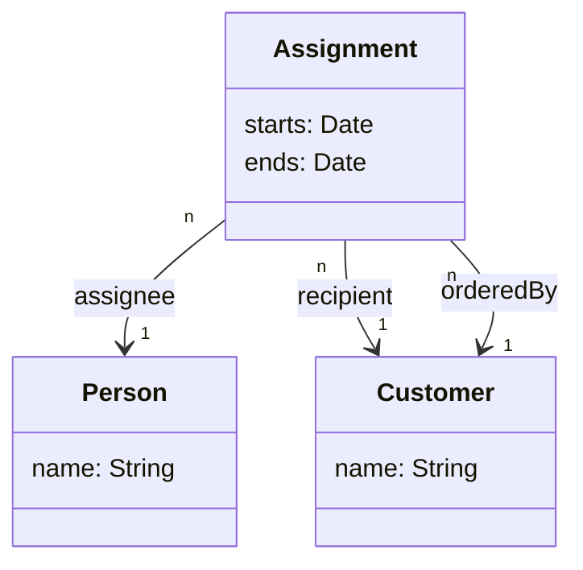

# Writing Resolvers

This section refines the basic bootstrap to a full API.

In this workshop data models are created using Sequelize for simplicity, but
raw SQL, knex/Objection.js or anything that can produce raw POJOs would
suffice for GraphQL resolvers. The variant we use `sequelize-typescript`,
heavily utilises TypeScript decorators, which we mainly use to ease the setup.

We also `TypeGraphQL` to generate some of the resolvers. In principle, it
could replace the whole GraphQL SDL (e.g. graphql.schema), but I have found
a "specification first" approach work better.

## Setup

```sh
# Sequelize dependencies
npm install --save sequelize @types/bluebird @types/node @types/validator reflect-metadata sequelize-typescript

# Postgres dependencies
npm install --save pg pg-hstore

# TypeGraphQL dependencies
npm install --save type-graphql

```sh
# Change these if you are using anything else than the default postgres setup
# psql -h $DB_HOST -p $DB_PORT -U $DB_ROOT_USER -d postgres -c graphql_workshop
psql -d postgres -c "CREATE DATABASE graphql_workshop"
export DB_CONNECTION_URL=postgres://localhost:5432/graphql_workshop
```

Define the following DB wrapper into `src/models/Database.ts`:

```typescript
import { Sequelize } from 'sequelize-typescript'
// TODO Remove these comments as we create the models
// import Assignment from './Assignment'
// import Customer from './Customer'
// import Person from './Person'

export default class Database {
  private sequelize: Sequelize
  private static DEFAULT_CONNECTION_URL: string = 'postgres://localhost:5432/graphql_workshop'
  private static INSTANCE: Database

  private constructor() {
    const url = process.env['DB_CONNECTION_URL'] || Database.DEFAULT_CONNECTION_URL
    this.sequelize = new Sequelize(url, {
      // TODO Remove these comments as we create the models
      models: [ /*Assignment, Customer, Person */ ],
    })
  }

  static get instance() {
    return Database.INSTANCE || (Database.INSTANCE = new Database())
  }

  async init() {
    // Enforce sequelize initialization (force param drop existing tables)
    await this.sequelize.sync({
      force: true
    })
  }
}
```

Also append the backend bootstrap at `src/index.ts` to initialise database connection:

```typescript
async function start() {
  // Initialize database
  const db = Database.instance
  await db.init()

  // Start the server
  const server = new ApolloServer({ typeDefs, resolvers })
  const { url } = await server.listen()
  console.log(`🚀 Server ready at ${url}`)
}
```

## Data Models

Consider the following (simplified) domain model:




Define the following classes in `src/models/` as `Assignment.ts`, `Customer.ts`, `Person.ts`:

```typescript
import { DataType, Model, Table, Column, PrimaryKey, ForeignKey, IsUUID, IsDate } from 'sequelize-typescript'
import Customer from './Customer'
import Person from './Person'

@Table
export default class Assignment extends Model<Assignment> {

  @IsUUID(4)
  @PrimaryKey
  @Column(DataType.UUID)
  id!: string;

  @IsUUID(4)
  @ForeignKey(() => Person)
  @Column(DataType.UUID)
  assigneeId!: string;

  @IsUUID(4)
  @ForeignKey(() => Customer)
  @Column(DataType.UUID)
  recipientId!: string;

  @IsUUID(4)
  @ForeignKey(() => Customer)
  @Column(DataType.UUID)
  orderedById!: string;

  @IsDate
  @Column
  starts!: Date

  @IsDate
  @Column
  ends!: Date
}
```

```typescript
import { DataType, Model, Table, Column, PrimaryKey, IsUUID } from 'sequelize-typescript'

@Table
export default class Customer extends Model<Customer> {

  @IsUUID(4)
  @PrimaryKey
  @Column(DataType.UUID)
  id!: string

  @Column
  name!: string
}
```

```typescript
import { DataType, Model, Table, Column, PrimaryKey, IsUUID } from 'sequelize-typescript'

@Table
export default class Person extends Model<Person> {

  @IsUUID(4)
  @PrimaryKey
  @Column(DataType.UUID)
  id!: string

  @Column
  name!: string
}
```

### Nested resolvers

### Custom Types (JSON, UUID etc.)

### Data Loaders (Solving the N+1 Problem & Caching)

## Building a GraphQL Client

### Querying for data

### Mutating data

### Using Fragments (for recurring fetch patterns)

## Supplementary Topics

### Generating Types from Schema

## References
- [sequelize-typescript](https://github.com/RobinBuschmann/sequelize-typescript)
- []
* (TypeGraphQL - define GraphQL types with annotations)[https://typegraphql.ml/]
