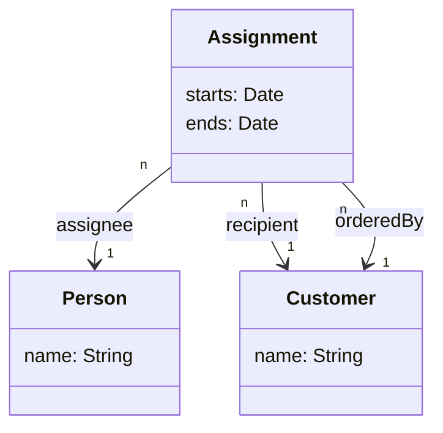

# Writing a Refined Backend

This chapter refines the basic bootstrap to a full API:
1. Create the Data Models using [sequelize-typescript](https://www.npmjs.com/package/sequelize-typescript)
1. Create TypeScript typings from schma using [GraphQL Code Generator](https://graphql-code-generator.com/)
1. Bind them together using [GraphQL Modules](https://graphql-modules.com/)

We apply "specification first" approach here, e.g. define the GraphQL schema first as it eases
generating shared TypeScript definitions for frontend and backend. If you prefer "code first"
approach you can use e.g. [TypeGraphQL](https://typegraphql.ml/), but we do not cover it here.

## Define Database & Data Models

### Database

Create the database as follows:

```sh
# Change these if you are using anything else than the default postgres setup
# psql -h $DB_HOST -p $DB_PORT -U $DB_ROOT_USER -d postgres -c graphql_workshop
psql -d postgres -c "CREATE DATABASE graphql_workshop"
export DB_CONNECTION_URL=postgres://localhost:5432/graphql_workshop
```

### Database Wrapper

Define the following DB wrapper into `src/models/Database.ts`:

```typescript
import { Sequelize } from 'sequelize-typescript'
// TODO Remove these comments as we create the models
// import Assignment from './Assignment'
// import Customer from './Customer'
// import Person from './Person'

export default class Database {
  private sequelize: Sequelize
  private static DEFAULT_CONNECTION_URL: string = 'postgres://localhost:5432/graphql_workshop'
  private static INSTANCE: Database

  private constructor() {
    const url = process.env['DB_CONNECTION_URL'] || Database.DEFAULT_CONNECTION_URL
    this.sequelize = new Sequelize(url, {
      // TODO Remove these comments as we create the models
      models: [ /*Assignment, Customer, Person */ ],
    })
  }

  static get instance() {
    return Database.INSTANCE || (Database.INSTANCE = new Database())
  }

  async init() {
    // Enforce sequelize initialization
    // Call sync({ force: true }) if you permit dropping and re-creating tables
    await this.sequelize.sync()
  }
}
```

Also append the backend bootstrap at `src/index.ts` to initialise database connection:

```typescript
async function start() {
  // Initialize database
  const db = Database.instance
  await db.init()

  // Start the server
  const server = new ApolloServer({ typeDefs, resolvers })
  const { url } = await server.listen()
  console.log(`🚀 Server ready at ${url}`)
}
```

### Data Models

Consider the following (simplified) domain model:



Define the following classes in `src/models/` as `Assignment.ts`, `Customer.ts`, `Person.ts`:

```typescript
import { DataType, Model, Table, Column, PrimaryKey, ForeignKey, IsUUID, IsDate } from 'sequelize-typescript'
import Customer from './Customer'
import Person from './Person'

@Table
export default class Assignment extends Model<Assignment> {

  @IsUUID(4)
  @PrimaryKey
  @Column(DataType.UUID)
  id!: string;

  @IsUUID(4)
  @ForeignKey(() => Person)
  @Column(DataType.UUID)
  assigneeId!: string;

  @IsUUID(4)
  @ForeignKey(() => Customer)
  @Column(DataType.UUID)
  recipientId!: string;

  @IsUUID(4)
  @ForeignKey(() => Customer)
  @Column(DataType.UUID)
  orderedById!: string;

  @IsDate
  @Column
  starts!: Date

  @IsDate
  @Column
  ends!: Date
}
```

```typescript
import { DataType, Model, Table, Column, PrimaryKey, IsUUID } from 'sequelize-typescript'

@Table
export default class Customer extends Model<Customer> {

  @IsUUID(4)
  @PrimaryKey
  @Column(DataType.UUID)
  id!: string

  @Column
  name!: string
}
```

```typescript
import { DataType, Model, Table, Column, PrimaryKey, IsUUID } from 'sequelize-typescript'

@Table
export default class Person extends Model<Person> {

  @IsUUID(4)
  @PrimaryKey
  @Column(DataType.UUID)
  id!: string

  @Column
  name!: string
}
```

## Define Resolvers
### Bootstrap GraphQL Codegen

GraphQL CodeGen allows typings definitions from schema files and can be used for both frontend and backend.

```sh
# GraphQL Code Generator dependencies for "specification first" approach
npm install --save-dev @graphql-codegen/cli @graphql-codegen/typescript \
  @graphql-codegen/typescript-operations @graphql-codegen/typescript-resolvers \
  @graphql-codegen/typescript-react-apollo
jq -r '.scripts.generate_types = "graphql-codegen --config graphql-codegen.yml"' \
  package.json | sponge package.json

cat <<EOF >./graphql-codegen.yml
overwrite: true
schema: ./schema.graphql
config:
  # We add the interface prefix to types to avoid name clashes
  typesPrefix: I
generates:
  # Frontend typings
  ../frontend/src/lib/GraphQLTypings.tsx:
    plugins:
      - 'typescript'
      - 'typescript-operations'
      - 'typescript-react-apollo'
  # Common schema typings
  ../backend/src/interfaces/schemaTypings.ts:
    plugins:
      - 'typescript'
      - 'typescript-resolvers'
EOF
```

### Define Modules

While all resolvers could be written into a single resolvers file, they are easier to manage when
modularised. There are many ways to modules, but in this workshop we use GraphQL Modules package,
which helps to separate type definitions their related resolvers as modules.

Note: While GraphQL Modules supports nesting GraphQL Schemas in modules, we stick to the shared
schema.graphql until there is a real need to split (this happens rarely). However, the different
resolvers and queries grow fast, hence we start by splitting them from the very beginning.

Append a root level GraphQL module definition directly into `src/index.ts`:

```typescript
import fs from 'fs'
import path from 'path'
import { ApolloServer, gql } from 'apollo-server'
import { GraphQLModule } from '@graphql-modules/core';
import Database from './models/Database'
import AssignmentModule from './modules/AssignmentModule'

// Load schema from an external file (relative to build directory).
const schema = fs.readFileSync(path.join(__dirname, '..', 'schema.graphql'))
const typeDefs = gql`${schema}`

async function start() {
  // Initialize database
  const db = Database.instance
  await db.init()

  // Define the root module wrapper to split resolvers.
  // Note: Contrary to the normal setup we do not modularise schema definitions
  const root = new GraphQLModule({
    typeDefs,
    // Add these when the corresponding modules have been written
    imports: [ AssignmentModule ]
  })

  // Start the server
  const server = new ApolloServer({
    modules: [root],
    context: session => session
  })
  const { url } = await server.listen()
  console.log(`🚀 Server ready at ${url}`)
}

start()
```

Define Assignment module `src/modules/assignment/index.ts` as follows:

```typescript
import { GraphQLModule } from '@graphql-modules/core'
import { IResolvers, IAssignment } from '../interfaces/schemaTypings'
import Assignment from '../models/Assignment'

const resolvers: IResolvers = {
  Query: {
    assignments: async (): Promise<IAssignment[]> => {
      return Assignment.findAll()
    }
  }
}

export default new GraphQLModule({
  resolvers
})
```

Note that `IAssignment` here is the TypeScripted GraphQL type definition, whereas `Assignment`
comes from the module. They magically fit together as the interface is a subset of the class definition.

Add sample data to the database, and watch the first resolvers to be loaded!

## References

- [sequelize-typescript](https://github.com/RobinBuschmann/sequelize-typescript)
- [GraphQL Code Generator](https://graphql-code-generator.com/)
- [GraphQL Modules](https://graphql-modules.com/)
- [TypeGraphQL - define GraphQL types with annotations](https://typegraphql.ml/)

## Navigation

* [Previous Chapter](3_Simple_Backend.md)
* [Next Chapter](5_Bootstrap_Frontend.md)