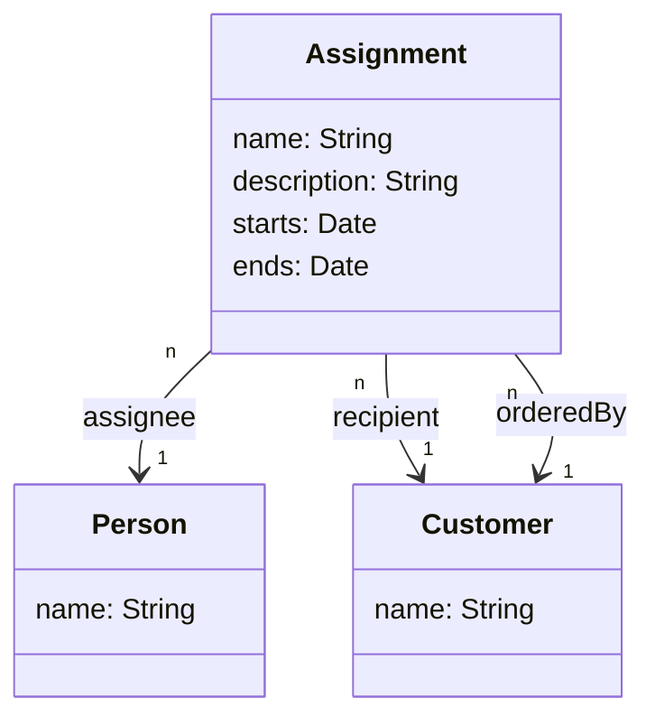

# Writing a Refined Backend

This chapter refines the basic bootstrap to a full API:
1. Create a schema with a few types and queries
1. Generate TypeScript typings from the schema using [GraphQL Code Generator](https://graphql-code-generator.com/)
1. Wrap (query) resolvers into [GraphQL Modules](https://graphql-modules.com/)
1. Create related data models using [sequelize-typescript](https://www.npmjs.com/package/sequelize-typescript)

We apply "specification first" approach here, e.g. define the GraphQL schema first as it eases
generating shared TypeScript definitions for frontend and backend. If you prefer "code first"
approach you can use e.g. [TypeGraphQL](https://typegraphql.ml/), but we do not cover it here.

## Define Schema

Let us start schema first, as it provides some structure to our further work.

### Define Assignments Schema

Define Assignment module `src/modules/assignment/schema.graphql` as follows:

```graphql
"""
This is a sample GraphQL multi-line comment. GraphQL supports simple API
documentation as part of the schema definition. This is actually enough for
all needs I have encountered this far.

You can browse this in schema browsers

TODO Add definitions for starts and ends when we add custom data types
"""
type Assignment {
  id: ID!
  # A single-line comment
  name: String!
  """
  Multi-line comments are supported here, as well
  """
  description: String
  starts: DateTime!
  ends: DateTime!
}

"""
In GraphQL, inputs are special types to encapsulate complex inputs
"""
input AssignmentInput {
  name: String!
  description: String
  starts: DateTime!
  ends: DateTime!
}

```

### Bootstrap GraphQL Codegen

GraphQL CodeGen eases the type-safety across frontend and backend. Let's define
the type definitions here.

```sh
# GraphQL Code Generator dependencies for "specification first" approach
npm install --save-dev @graphql-codegen/cli @graphql-codegen/typescript \
  @graphql-codegen/typescript-operations @graphql-codegen/typescript-resolvers \
  @graphql-codegen/typescript-react-apollo @graphql-codegen/near-operation-file-preset \
  @graphql-codegen/introspection
jq -r '.scripts.generate_types = "graphql-codegen --config graphql-codegen.yml"' \
  package.json | sponge package.json

cat <<EOF >./graphql-codegen.yml
overwrite: true
schema: ./src/modules/**/*.graphql
config:
  # We add the interface prefix to types to avoid name clashes
  typesPrefix: I
generates:
  # Backend typings
  ../backend/src/interfaces/schema-typings.ts:
    plugins:
      - 'typescript'
      - 'typescript-resolvers'

EOF
```

Now that graphql-codegen is set, we can try generating the typings:

```sh
npm run generate_types
```

Examine the results at `./src/interfaces/schema-typings`. 

You may also want to ignore linting for the typings:

```sh
cat <<EOF >.eslintignore
src/interfaces/schemaTypings.tsbackend

EOF
```

## Define Resolvers

While all resolvers could be written into a single resolvers file, they are
easier to manage when modularised. There are many ways to modules, but in this
workshop we use GraphQL Modules package, which helps to separate type
definitions from their related resolvers as modules.

A typical way to structure your application is one module per concept, with
its associated schema, queries, mutations and providers. Here a provider
refers to any piece of business logic that could potentially be reused by
multiple queries. It is also possible to write provider-only modules, e.g.
sharing a database connection, authorization logic etc. Modules can refer
to each other via dependency injection.

### Sample Assignment Module

Define Assignment module `src/modules/assignment/index.ts` as follows:

```typescript
import fs from 'fs'
import path from 'path'
import { createModule, gql } from 'graphql-modules'

const data = fs.readFileSync(path.join(__dirname, 'schema.graphql'))
const typeDefs = gql(data.toString())

// We will supply Assignment specific resolvers here later
const resolvers: IResolvers = {
}

export const Assignment = createModule({
  id: 'assignments',
  dirname: __dirname,
  typeDefs: typeDefs,
  resolvers,
  providers: [AssignmentProvider]
})

export default Assignment

```

Note that `IAssignment` and `IResolvers` are generated GraphQL type definitions.

### Refine Application Bootstrap Code

Append our first assignment module directly into `src/index.ts`:

```typescript
import { ApolloServer } from 'apollo-server'
import { createApplication } from 'graphql-modules'
import AssignmentModule from './modules/assignment'

async function start (): Promise<void> {
  // Initialize GraphQL modules
  const application = createApplication({
    modules: [AssignmentModule]
  })

  // This is the aggregated schema
  const schema = application.createSchemaForApollo()

  // Start the server
  const server = new ApolloServer({
    schema
  })
  const { url } = await server.listen()
  console.log(`🚀 Server ready at ${url}`)
}

// eslint-disable-next-line @typescript-eslint/no-floating-promises
start()

```

Note how we import the Assignment module, and wrap all the modules
into an application.

## Define Database & Data Models

Let's define a few database tables that we can can query via GraphQL.

Here is a (simplified) domain model of what we want to accomplish



### Database

Create the database as follows:

```sh
# Change these if you are using anything else than the default postgres setup
# psql -h $DB_HOST -p $DB_PORT -U $DB_ROOT_USER -d postgres -c graphql_workshop
psql -d postgres -c "CREATE DATABASE graphql_workshop"
export DB_CONNECTION_URL=postgres://localhost:5432/graphql_workshop
```

Now verify that you can connect to the database with your Database client.
You should see an empty `graphql_workshop` database.

### Data Models

Define the following classes in `src/models/` as `Assignment.ts`, `Customer.ts`, `Person.ts`:

```typescript
import { DataType, Model, Table, Column, PrimaryKey, ForeignKey, IsUUID, IsDate } from 'sequelize-typescript'
import Customer from './Customer'
import Person from './Person'

@Table
import { DataType, Model, Table, Column, PrimaryKey, ForeignKey, IsUUID, IsDate } from 'sequelize-typescript'
import Customer from './Customer'
import Person from './Person'

@Table
export default class Assignment extends Model {
  @IsUUID(4)
  @PrimaryKey
  @Column(DataType.UUID)
  id!: string

  @IsUUID(4)
  @ForeignKey(() => Person)
  @Column(DataType.UUID)
  assigneeId!: string

  @IsUUID(4)
  @ForeignKey(() => Customer)
  @Column(DataType.UUID)
  recipientId!: string

  @IsUUID(4)
  @ForeignKey(() => Customer)
  @Column(DataType.UUID)
  orderedById!: string

  @Column
  name!: string

  @Column
  description!: string

  @IsDate
  @Column
  starts!: Date

  @IsDate
  @Column
  ends!: Date
}

```

```typescript
import { DataType, Model, Table, Column, PrimaryKey, IsUUID } from 'sequelize-typescript'

@Table
export default class Customer extends Model {
  @IsUUID(4)
  @PrimaryKey
  @Column(DataType.UUID)
  id!: string

  @Column
  name!: string
}

```

```typescript
import { DataType, Model, Table, Column, PrimaryKey, IsUUID } from 'sequelize-typescript'

@Table
export default class Person extends Model {
  @IsUUID(4)
  @PrimaryKey
  @Column(DataType.UUID)
  id!: string

  @Column
  name!: string
}

```

### Database Wrapper

Define the following Singleton DB wrapper into `src/models/Database.ts`.
This will act as a handle to the database, and also initialize the tables
when bootstrapping.

```typescript
import { Sequelize } from 'sequelize-typescript'

import Assignment from './Assignment'
import Customer from './Customer'
import Person from './Person'

export default class Database {
  private readonly sequelize: Sequelize
  private static readonly DEFAULT_CONNECTION_URL: string = 'postgres://localhost:5432/graphql_workshop'
  private static INSTANCE: Database

  private constructor () {
    const url = process.env.DB_CONNECTION_URL ?? Database.DEFAULT_CONNECTION_URL
    this.sequelize = new Sequelize(url, {
      // TODO Remove these comments as we create the models
      models: [
        Assignment,
        Customer,
        Person
      ]
    })
  }

  static get instance (): Database {
    return Database.INSTANCE ?? (Database.INSTANCE = new Database())
  }

  async init (): Promise<void> {
    // Enforce sequelize initialization
    // Call sync({ force: true }) if you permit dropping and re-creating tables
    await this.sequelize.sync()
  }
}

```

Also append the backend bootstrap at `src/index.ts` to initialise database connection:

```typescript
async function start (): Promise<void> {
  // Initialize GraphQL modules
  const application = createApplication({
    modules: [AssignmentModule]
  })

  // This is the aggregated schema
  const schema = application.createSchemaForApollo()

  // Initialize database. Sequelize creates tables on bootstrapping
  const db = Database.instance
  await db.init()

  // Start the server
  const server = new ApolloServer({
    schema
  })
  const { url } = await server.listen()
  console.log(`🚀 Server ready at ${url}`)
}
```

Add the new dependency to the top of the `src/index.ts`: 

```typescript
import Database from './models/Database'
```

Now explore how your database tables get created when you add the types into
Database.ts. You should see `Assignments`, `Customers` and `People` tables
getting populated (it is interesting how Sequelize pluralizes `Person`).

## Bind Queries to Database with a Provider

Now let us bind the data models and queries together. GraphQL Modules has a
'provider' concept with basically is just a bundle of logic. Providers are
declared as part of GraphQL modules and can be shared via dependency injection.

This sample defines a simple provider and uses it in Assignment module query.

Define the provider into `src/modules/assignment/provider.ts`:

```typescript
import { Injectable } from 'graphql-modules'
import Assignment from '../../models/Assignment'

/**
 * This is a sample provider (just a logic wrapper) that is used as glue
 * between the database models and queries.
 *
 * Note that the `Injectable` decorator makes this provider injectable.
 * DI in graphql-modules is very much like Inversify, but it has additional
 * helpers for different life-cycles (singleton, session, request).
 *
 * We make the injectable global, as we expect to share it across the modules
 */
@Injectable({ global: true })

import { IAssignment } from '../../interfaces/schema-typings'
import { Injectable } from 'graphql-modules'
import { v4 as uuidv4 } from 'uuid'
import Assignment from '../../models/Assignment'

/**
 * This is a sample provider (just a logic wrapper) that is used as glue
 * between the database models and queries.
 *
 * Note that the `Injectable` decorator makes this provider injectable.
 * DI in graphql-modules is very much like Inversify, but it has additional
 * helpers for different life-cycles (singleton, session, request).
 */
@Injectable({ global: true })
export class AssignmentProvider {
  async find (): Promise<Assignment[]> {
    return await Assignment.findAll()
  }

  async create (input: IAssignment): Promise<Assignment> {
    return await Assignment.create({
      ...input,
      id: uuidv4()
    })
  }
}

export default AssignmentProvider

```

Finally, let us define the related queries. In this workshop we define all
queries and mutations in their own module `src/modules/operations`. This is
contrary to best practice to keep the operations close to their related types.
We simply do this as a technical workaround to create schemas that work both
for graphql-codegen and graphql-modules that handle GraphQL type extensions
differently since graphql-modules 1.0 release.
See more [here](https://github.com/Urigo/graphql-modules/issues/1300).

Module definition (`src/modules/operations/index.ts`)
```typescript 
import fs from 'fs'
import path from 'path'
import { createModule, gql } from 'graphql-modules'
import AssignmentProvider from '../assignment/provider'

import { IResolvers, IAssignment } from '../../interfaces/schema-typings'

const data = fs.readFileSync(path.join(__dirname, 'schema.graphql'))
const typeDefs = gql(data.toString())

const resolvers: IResolvers = {
  Query: {
    assignments: async (parent, args, context, info): Promise<IAssignment[]> => {
      const provider = context.injector.get(AssignmentProvider)

      return provider.find()
    }
  },
  Mutation: {
    createAssignment: async (parent, { input }, context, info): Promise<IAssignment> => {
      const provider = context.injector.get(AssignmentProvider)

      return provider.create(input)
    }
  }
}

export const OperationsModule = createModule({
  id: 'operations',
  dirname: __dirname,
  typeDefs: typeDefs,
  resolvers
})

export default OperationsModule

```

Module schema definition (`src/modules/operations/schema.graphql`):

```graphql
type Query {
  assignments: [Assignment!]!
}

type Mutation {
  createAssignment(input: AssignmentInput): Assignment!
}
```

Finally add the new module into your application bootstrap (`src/index.ts`).
In the end of the chapter, it should look as follows:

```typescript
import { ApolloServer } from 'apollo-server'
import { createApplication } from 'graphql-modules'
import AssignmentModule from './modules/assignment'
import OperationsModule from './modules/operations'

import Database from './models/Database'

async function start (): Promise<void> {
  // Initialize GraphQL modules
  const application = createApplication({
    modules: [
      AssignmentModule,
      OperationsModule
    ]
  })

  // This is the aggregated schema
  const schema = application.createSchemaForApollo()

  // Initialize database. Sequelize creates tables on bootstrapping
  const db = Database.instance
  await db.init()

  // Start the server
  const server = new ApolloServer({
    schema
  })
  const { url } = await server.listen()
  console.log(`🚀 Server ready at ${url}`)
}

// eslint-disable-next-line @typescript-eslint/no-floating-promises
start()

```

Now enter some data via your database client, and explore the results via
GraphQL playground.

This was a heavy chapter, but you made it!

## References

- [GraphQL Code Generator](https://graphql-code-generator.com/)
- [GraphQL Modules](https://graphql-modules.com/)
- [sequelize-typescript](https://github.com/RobinBuschmann/sequelize-typescript)
- [TypeGraphQL - define GraphQL types with annotations](https://typegraphql.ml/)

## Navigation

* [Previous Chapter](3_Simple_Backend.md)
* [Next Chapter](5_Bootstrap_Frontend.md)